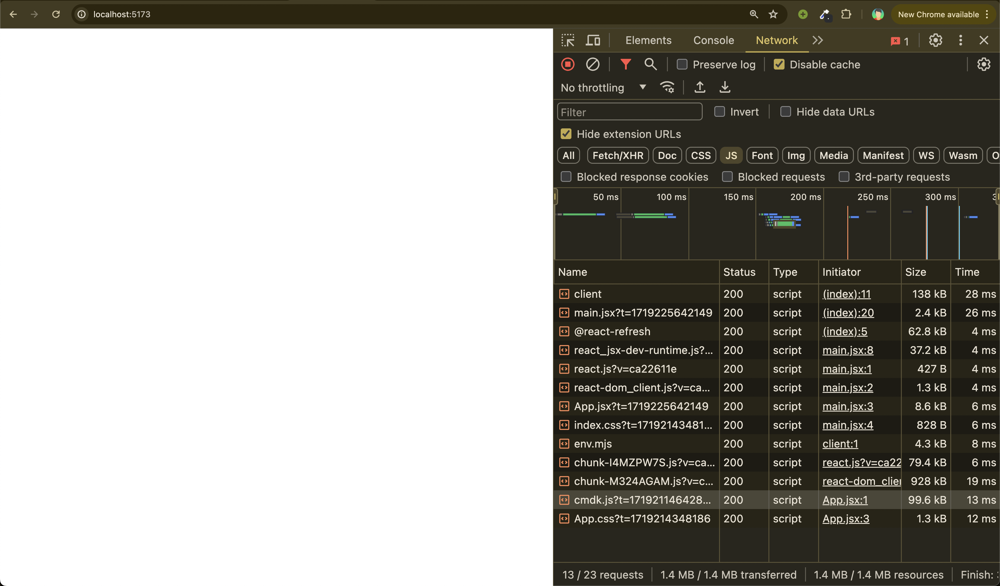
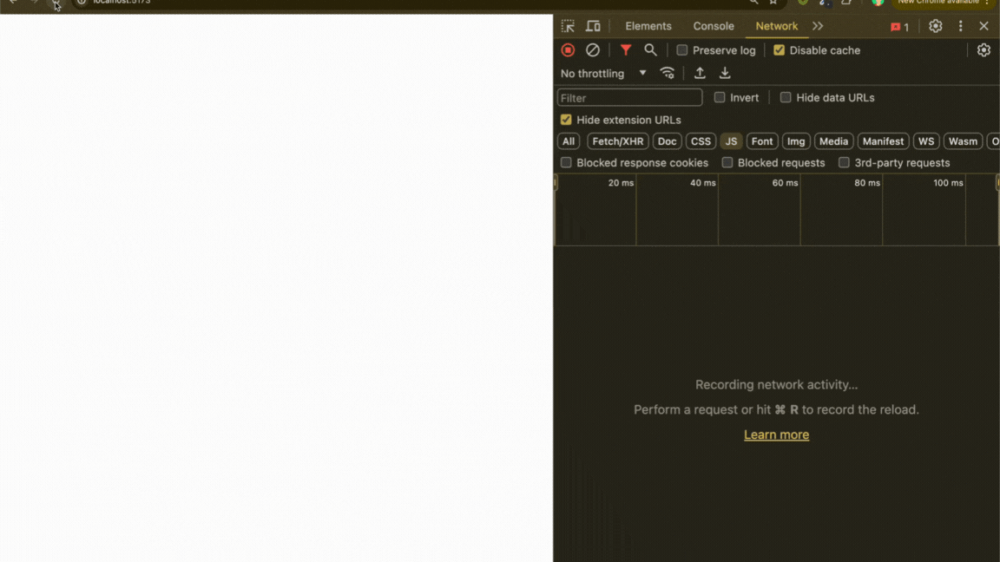

> <strong>Import On Interaction</strong> is a performance optimization technique that defers the loading of components until they are needed, based on user interactions.</div>

### Introduction

Have you ever felt your web application is slow because it tries to load everything all at once? Say goodbye to those long loading times with **lazy loading on interaction**. This technique allows us to load components only when the user interacts with the UI, making our apps faster and more efficient.

Let's dive in with an example using a command palette, and explore how this method can be a game-changer for larger, more complex components.

### The Problem: Loading Everything at Once

Loading all components upfront can significantly slow down the initial load time of your application. Not all components are needed immediately, so why load them all at once? By deferring the load of certain components until they are actually needed, we can improve the performance and responsiveness of our apps.

### The Example: Command Palette

[https://cmdk.paco.me]

For this example, we will be using the [cmdk (⌘K](https://cmdk.paco.me)) command palette component. **⌘K** is a command menu React component that can also be used as an accessible combobox. It's a handy tool for power users, but not everyone uses it frequently. Loading it only when the user decides to use it makes perfect sense.

### Implementing Command Palette Without Lazy Loading in a React Application

In this section, we'll explore how to implement a command palette in a React application without using lazy loading. We'll load the entire component upfront.

```javascript
import { Command } from "cmdk"; //Import the component
import React from "react";

function App() {
  const [open, setOpen] = React.useState(false);

  // Toggle the menu when ⌘K is pressed
  React.useEffect(() => {
    const down = (e) => {
      if (e.key === "k" && (e.metaKey || e.ctrlKey)) {
        e.preventDefault();
        setOpen((open) => !open);
      }
    };

    document.addEventListener("keydown", down);
    return () => document.removeEventListener("keydown", down);
  }, []);

  return (
    <Command.Dialog
      open={open}
      onOpenChange={setOpen}
      label="Global Command Menu"
    >
      <Command.Input />
      <Command.List>
        <Command.Group>
          <Command.Item>Item 1</Command.Item>
          <Command.Item>Item 2</Command.Item>
          <Command.Separator />
          <Command.Item>item 3</Command.Item>
        </Command.Group>
      </Command.List>
    </Command.Dialog>
  );
}

export default App;
```

In the above code, we have used the command palette library by directly importing and using it. Let's check the network tab.



- The `cmdk` script loads immediately upon page load, even before the command palette is opened.
- This premature loading of resources that aren't immediately necessary can introduce unnecessary delays, potentially slowing down our application's performance.
- To remedy this, we'll implement a strategy to load the script only when the user invokes the command palette.
- By deferring the loading of these resources until they are needed, we can significantly enhance our application's responsiveness and user experience.

Let's delve into how we can achieve this optimization!

### Implementing Lazy Loading: Import On Interaction🚀

In this section, we will learn how to implement import on interaction, which means importing the `cmdk` package only when the user presses `cmd + K` to display the command palette.

Let's update our above code,

- First let's add one more state which stores the command palette component
  ```javascript
  const [open, setOpen] = useState(false);
  const [commandPalette, setCommandPalette] = useState(null);
  ```
- Write a method that imports the `cmdk` package and stores the component in our newly created state:
  ```javascript
  const loadCommandPalette = () => {
    import(/* webpackChunkName: "command-palette" */ "cmdk")
      .then((module) => {
        setCommandPalette(module.Command);
      })
      .catch((error) => {
        console.error("Error loading command palette:", error);
      });
  };
  ```
- Update the logic inside our `useEffect` hook to run this method when pressing `cmd + k`.

  ```javascript
  useEffect(() => {
    const down = (e) => {
      if (e.key === "k" && (e.metaKey || e.ctrlKey)) {
        e.preventDefault();
        if (!commandPalette) {
          loadCommandPalette();
        }
        setOpen((prevOpen) => !prevOpen);
      }
    };

    document.addEventListener("keydown", down);
    return () => document.removeEventListener("keydown", down);
  }, [commandPalette]);
  ```

- Render the component stored in the state: to render the component stored in the state, we need to check if the `commandPalette` state is not null. If it is not null, we can then render the component. This ensures that the command palette is only displayed when it has been successfully loaded. Here is how you can do it:
  ```javascript
  return (
    <div>
      {commandPalette && (
        <commandPalette.Dialog
          open={open}
          onOpenChange={setOpen}
          label="Global Command Menu"
        >
          <commandPalette.Input />
          <commandPalette.List>
            <commandPalette.Group>
              <commandPalette.Item>Item 1</commandPalette.Item>
              <commandPalette.Item>Item 2</commandPalette.Item>
              <commandPalette.Separator />
              <commandPalette.Item>Item 3</commandPalette.Item>
            </commandPalette.Group>
          </commandPalette.List>
        </commandPalette.Dialog>
      )}
    </div>
  );
  ```

---

### Putting it all together:

```javascript
import React from "react";

function App() {
  const [open, setOpen] = React.useState(false);
  const [commandPalette, setCommandPalette] = React.useState(null);

  const loadCommandPalette = () => {
    import(/* webpackChunkName: "command-palette" */ "cmdk")
      .then((module) => {
        setCommandPalette(module.Command);
      })
      .catch((error) => {
        console.error("Error loading command palette:", error);
      });
  };
  // Toggle the menu when ⌘K is pressed
  React.useEffect(() => {
    const down = (e) => {
      if (e.key === "k" && (e.metaKey || e.ctrlKey)) {
        e.preventDefault();
        if (!commandPalette) {
          loadCommandPalette();
        }
        setOpen((prevOpen) => !prevOpen);
      }
    };

    document.addEventListener("keydown", down);
    return () => document.removeEventListener("keydown", down);
  }, [commandPalette]);

  return (
    <div>
      {commandPalette && (
        <commandPalette.Dialog
          open={open}
          onOpenChange={setOpen}
          label="Global Command Menu"
        >
          <commandPalette.Input />
          <commandPalette.List>
            <commandPalette.Group>
              <commandPalette.Item>Item 1</commandPalette.Item>
              <commandPalette.Item>Item 2</commandPalette.Item>
              <commandPalette.Separator />
              <commandPalette.Item>Item 3</commandPalette.Item>
            </commandPalette.Group>
          </commandPalette.List>
        </commandPalette.Dialog>
      )}
    </div>
  );
}

export default App;
```

### The impact:

Let's open the network tab and see how this works



- As the page initially loads, you'll notice that the `cmdk` script isn't present or actively loaded.
- However, as soon as I press `Cmd + K` to open the command palette, watch closely in the network tab, suddenly a new 99KB JavaScript file dynamically appears.
- This file is specifically fetched at that moment to bring in the necessary code for the command palette functionality.
- This dynamic loading approach ensures that we're only loading resources when they're actually needed, which optimizes our application's initial load time and enhances overall performance.
- It's like summoning magic exactly when you need it—keeping things fast and efficient!

### Why It Matters: Beyond Small Examples

While our command palette example resulted in a modest 99KB deferred load, this approach can significantly enhance performance for larger, heavier components like:

- **Rich Text Editors**
- **Data Visualization Libraries**
- **Advanced Form Builders**
- **Complex Modal Dialogs**

> Start optimizing your React application today by deferring the load of non-critical components. Your users will thank you for the faster, more responsive experience. 🚀
