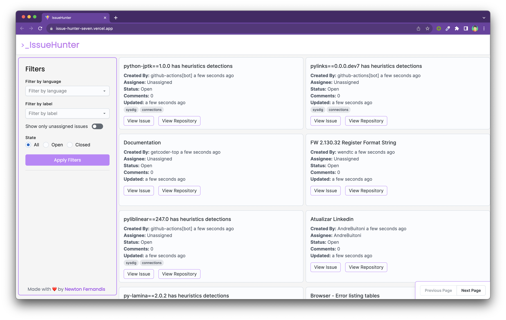

IssueHunter is a powerful GitHub issue search tool designed to streamline your issue-hunting process. Whether you're a coding wizard or a project management sorcerer, IssueHunter is here to assist you in discovering GitHub issues with remarkable efficiency.



## Key Features

- **Effortless Issue Discovery**: Quickly search and discover GitHub issues with ease.
- **Advanced Filtering**: Refine your search results using various filters, eliminating the need for manual sifting.

## Getting Started

Let's get you started with IssueHunter, your trusted issue-searching sidekick. Follow these simple steps:

### Prerequisites

- Node.js: If you don't already have Node.js installed, you can download it from [nodejs.org](https://nodejs.org/).

### Installation

1. Clone the repository:

   ```shell
   git clone https://github.com/NewtonFernandis/IssueHunter.git
   ```

2. Navigate to the project directory:

   ```shell
   cd IssueHunter
   ```

3. Install the necessary dependencies:

   ```shell
   npm install
   ```

### Configuration

IssueHunter requires a GitHub personal access token for authentication. Here's how to set it up:

1. Create your personal GitHub access token by following the instructions [here](https://docs.github.com/en/authentication/keeping-your-account-and-data-secure/creating-a-personal-access-token).

2. Create a `.env` file in the project's root directory and add your access token:

   ```shell
   GITHUB_PERSONAL_ACCESS_TOKEN=your-access-token-here
   ```

### Running the Development Server

Ready to harness your issue-hunting powers? Launch the development server with this command:

```shell
npm run dev
```

Your browser will become your trusty crystal ball, guiding you to IssueHunter at [http://localhost:3000](http://localhost:3000).

### Building for Production

When you're prepared to showcase your magical GitHub issue-finding skills to the world, use this command to create your production masterpiece:

```shell
npm run build
```

This will generate an optimized production build in the `dist` directory.

We welcome your thoughts and collaboration. Your contributions are embraced with open arms! 🪄🌟

## 🏛️ License

MIT
