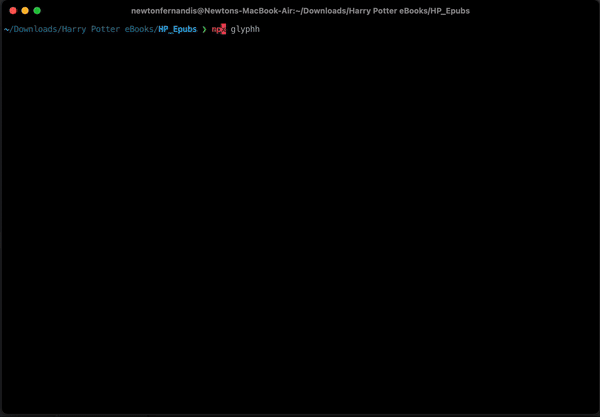

# Glyphh

Glyphh is a tool to read EPUB files in the terminal with a beautiful user experience.



## Table of Contents

- [Installation](#installation)
- [Usage](#usage)
- [Local Development](#local-development)
- [Contributing](#contributing)

## Usage

```sh
npx glyphh
```

After running the command, Glyphh will guide you through a series of prompts to select and read your EPUB files.

## Local Development

If you want to contribute to Glyphh or run it locally for development purposes, follow these steps:

1. ### Clone the repository:

```sh
git clone https://github.com/NewtonFernandis/glyph.git
cd glyph
```

2. ### Install dependencies:

```sh
npm install
```

3. ### Run the tool locally:

```sh
node index.js
```

## Contributing

We welcome contributions! If you would like to contribute to Glyphh, please follow these steps:

1. Fork the repository on GitHub
2. Create a new branch for your feature or bugfix
3. Make your changes and commit them with descriptive messages
4. Push your changes to your fork
5. Create a pull request on the main repository
6. Please make sure your code adheres to the project's coding standards and includes appropriate tests.
